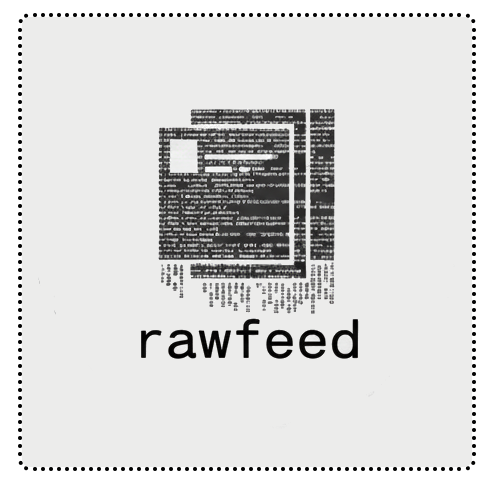

<p align="center">
  
  <br>
  <small>rawfeed-jekyll — A raw Jekyll theme for minimalists</small>
  <br>
  <a href="https://badge.fury.io/rb/rawfeed"></a>
</p>

# For developer

## Requirements

| Required | Version | How to verify | How to install                    |
| -------- | ------- | ------------- | --------------------------------- |
| Git      | >= 2    | `git -v`      | [Git](http://git-scm.com/)        |
| Ruby     | >= 3.0  | `ruby -v`     | [Ruby](https://www.ruby-lang.org) |
| Gem      | >= 3.0  | `gem -v`      | **Ruby** contains **Gem**         |
| Bundler  | >= 2.0  | `bundler -v`  | `gem install bundler`             |
| NodeJs   | >= 20   | `node -v`     | [NodeJS](https://nodejs.org)      |
| Npm      | >= 9    | `npm -v`      | **NodeJS** contains **Npm**       |


## Clone

```shell
git clone https://github.com/rawfeed/rawfeed-jekyll.git "rawfeed"; cd rawfeed; npm install
```

## Gem

**(1)** - Compile the gem:

```shell
npm run generate:gem
```

**(2)** - Publish the gem:

```shell
npm run publish:gem
```

For more tasks, see: `npm run rake:tasks`

# Changelog

See [here](https://rawfeed.github.io/rawfeed-jekyll/changelog/)

# License

The theme is available as open source under the terms of [this License](https://rawfeed.github.io/rawfeed-jekyll/license/).
