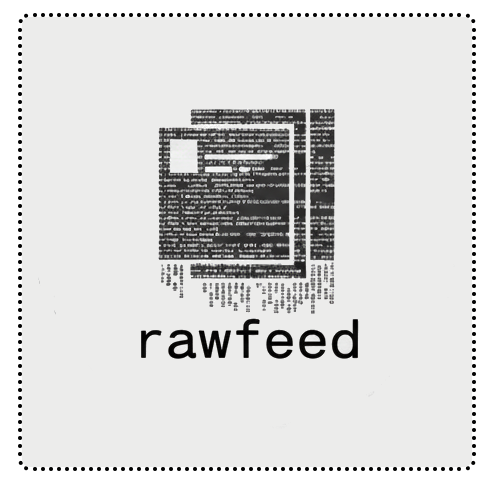

<p align="center">
  
  <br>
  <small>rawfeed-jekyll — A minimal, batteries-included Jekyll CMS</small>
  <br>
  <a href="https://badge.fury.io/rb/rawfeed" target="_blank"></a>
  <br>
  <a href="https://rawfeed.github.io/rawfeed-jekyll" target="_blank">Documentation</a>
</p>

# rawfeed-jekyll

**rawfeed-jekyll** is a lightweight Jekyll CMS and theme framework for Ruby 3.x. It provides a modern workflow for site creation, theme distribution, and gem-based package delivery.

## Project resources

- [CONTRIBUTING.md](CONTRIBUTING.md)
- [CODE_OF_CONDUCT.md](CODE_OF_CONDUCT.md)
- [CHANGELOG.md](CHANGELOG.md)
- [RELEASE_CHECKLIST.md](RELEASE_CHECKLIST.md)
- `.github/ISSUE_TEMPLATE/`
- `.github/pull_request_template.md`
- `.github/release_template.md`

## Requirements

| Required | Version | How to verify | How to install                    |
| -------- | ------- | ------------- | --------------------------------- |
| Ruby     | >= 3.0  | `ruby -v`     | [Ruby](https://www.ruby-lang.org) |
| Gem      | >= 3.0  | `gem -v`      | Bundled with Ruby                 |
| Bundler  | >= 2.0  | `bundler -v`  | `gem install bundler`             |

## Install

See the full documentation at [https://rawfeed.github.io/rawfeed-jekyll/](https://rawfeed.github.io/rawfeed-jekyll/).

## Developer setup

```shell
git clone https://github.com/rawfeed/rawfeed-jekyll.git
cd rawfeed-jekyll
export RAWFEED_DEV_PATH="$PWD"
rawfeed install
bundle exec rawfeed serve
```

> [!TIP]
>
> ### Using direnv
>
> ```bash
> echo "export RAWFEED_DEV_PATH=\"\$PWD\"" > .envrc
> direnv allow
> ```

## Contribution workflow

This repository includes GitHub templates for issues and pull requests.

- Bug reports: `.github/ISSUE_TEMPLATE/bug_report.md`
- Feature requests: `.github/ISSUE_TEMPLATE/feature_request.md`
- Pull requests: `.github/pull_request_template.md`

See [CONTRIBUTING.md](CONTRIBUTING.md) for the complete contributor workflow, release process, and code guidelines.

## Release process

The release workflow is documented in [RELEASE_CHECKLIST.md](RELEASE_CHECKLIST.md) and [CHANGELOG.md](CHANGELOG.md).

- Version is defined in `lib/rawfeed/core/version.rb`
- Package metadata is in `rawfeed.gemspec`
- CI is configured in `.github/workflows/ci.yml`
- Release notes are captured by `.github/release_template.md`
- Release branches should follow `release/<version>` and use `RELEASE_CHECKLIST.md` as the release branch base
- Changelog automation can be done with `github_changelog_generator` in development

## Continuous integration

This repository uses GitHub Actions to run the complete release workflow on pull requests to `main` and on pushes to `main` or `release/**` branches.

The CI job performs:

- `bundle install` with Bundler cache
- library loading validation via `bundle exec ruby -Ilib -e 'require "rawfeed"'
- `bundle exec rspec` for test coverage
- `bundle exec jekyll build --destination .site_build` to ensure the theme builds cleanly
- `gem build rawfeed.gemspec` to verify package creation

## Changelog generation

This repository includes a development tool to help generate changelogs from GitHub issues and tags.
The project is configured in `.github_changelog_generator`, which uses `key=value` pairs (one per line) — **not** the CLI `--flag value` format.
By default, the tool generates or updates `CHANGELOG.md` in the repository root.

Use the following command after installing development dependencies:

```shell
bundle exec github_changelog_generator
```

If you prefer a manual approach, keep editing `CHANGELOG.md` by hand.

## Build and publish

Build the gem package:

```shell
bundle exec rake build
```

Publish the gem to RubyGems:

```shell
gem push rawfeed-<VERSION>.gem
```

## Changelog

The project changelog is maintained in [CHANGELOG.md](CHANGELOG.md).

## License

This project is released under the terms of [this license](https://rawfeed.github.io/rawfeed-jekyll/license/).

## Donate

If you appreciate this project, consider supporting development.

<div class="donate">
  <a href="https://williamcanin.github.io/donate/" target="_blank">
    
  </a>
</div>
